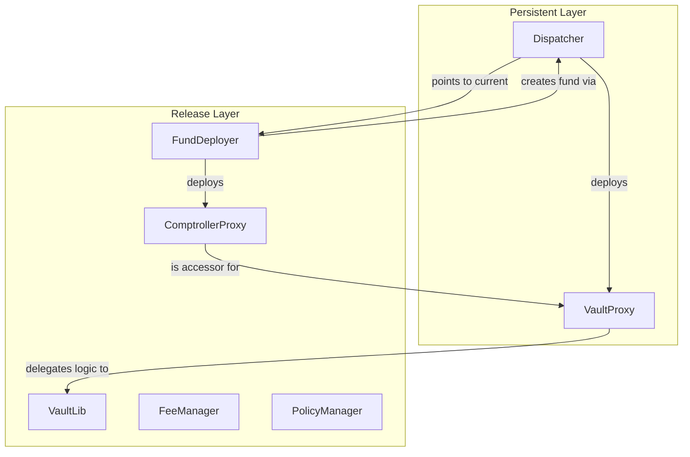
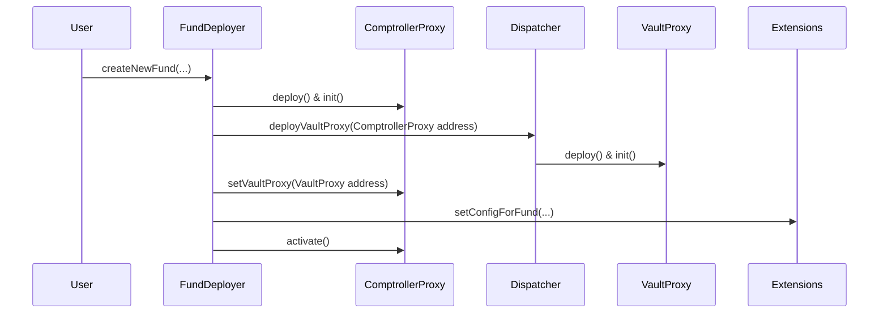
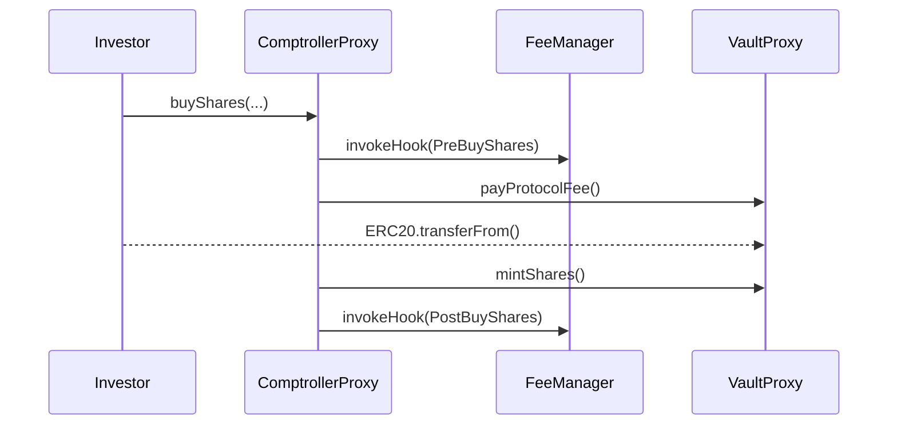
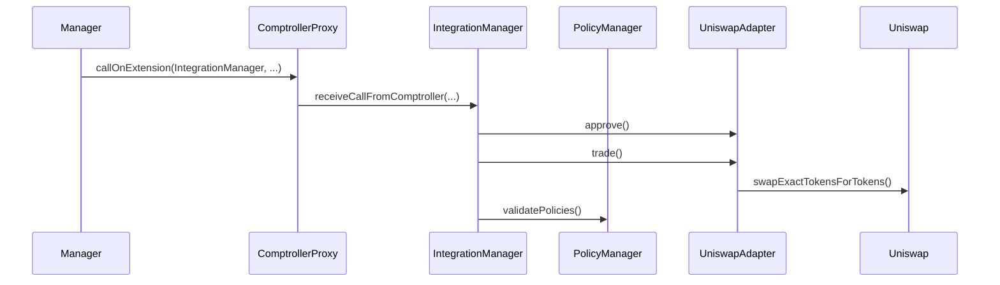
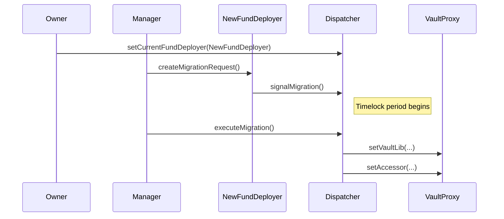

# Enzyme Protocol: System Overview

## Core Architecture: Persistent and Release Layers

The Enzyme protocol is built on a sophisticated two-layer architecture designed for robust security and seamless upgradeability. This separation is the key to the protocol's ability to evolve and add new features without disrupting existing funds or requiring asset migrations.

### 1. The Persistent Layer

The Persistent Layer consists of a set of singleton contracts that are designed to be immutable and permanent. These contracts are deployed only once and are never changed. They serve as the stable foundation and anchor points for the entire system.

-   **`Dispatcher`**: The most critical contract in this layer. It is the central "kernel" of the protocol. Its responsibilities are:
    -   Acting as the single, authoritative factory for all funds (`VaultProxy` contracts).
    -   Maintaining a pointer to the `FundDeployer` contract of the current, live protocol release.
    -   Orchestrating the secure, time-locked migration of funds from an old release to a new one.

-   **`VaultProxy`**: The contract that holds a fund's assets. It is a lightweight, EIP-1822 compliant proxy whose only job is to delegate all logic to a `VaultLib` (logic) contract. Because the assets are held in the proxy, the fund's logic can be upgraded without ever needing to move the assets.

-   **Other Persistent Contracts**: This layer also includes other singleton contracts like the `ExternalPositionFactory`, which is responsible for deploying proxies for complex, non-ERC20 positions.

### 2. The Release Layer

The Release Layer contains all the logic and business rules for a specific version of the Enzyme protocol. When a new version of Enzyme is released (e.g., to add new features or integrations), a completely new set of Release Layer contracts is deployed.

-   **`FundDeployer`**: The main entry point for a specific release. It's responsible for:
    -   Creating new funds by calling the `Dispatcher`.
    -   Configuring the fund's `ComptrollerProxy` and all its associated extensions (fees, policies, etc.).
    -   Handling the logic for migrating funds *into* its release and *out of* its release during a protocol upgrade.

-   **`ComptrollerProxy` and `ComptrollerLib`**: The "brain" of a fund. The `ComptrollerProxy` is the unique `accessor` for its `VaultProxy`, meaning only it can instruct the `Vault` to perform actions. All `ComptrollerProxy` contracts in a release delegate their logic to a single, shared `ComptrollerLib` instance.

-   **Extension Contracts** (`FeeManager`, `PolicyManager`, `IntegrationManager`, etc.): These contracts handle specialized areas of logic, keeping the `ComptrollerLib` focused on core orchestration.

-   **`ValueInterpreter`**: The protocol's oracle aggregator, responsible for providing price information for all supported assets.

### How They Work Together

The `Dispatcher` acts as the bridge. It holds the address of the *current* `FundDeployer`. When a user wants to create a fund, they interact with the current `FundDeployer`, which in turn calls the `Dispatcher` to deploy the `VaultProxy`. This ensures that all funds, regardless of which release they were created on, originate from the same trusted factory.

This two-layer design provides a powerful combination of stability (the Persistent Layer) and flexibility (the Release Layer).

---

## Fund Creation Flow: Step-by-Step

Creating a new fund is a sophisticated process that involves a coordinated "dance" between the Release Layer and the Persistent Layer. Here is a step-by-step walkthrough of what happens when a user calls `createNewFund` on the `FundDeployer`.

1.  **`FundDeployer`: Deploy `ComptrollerProxy`**
    -   The `FundDeployer` first deploys a new, unique `ComptrollerProxy` for the fund.
    -   During its construction, the `ComptrollerProxy` is linked to the shared `ComptrollerLib` for this release.
    -   The `init` function of the `ComptrollerProxy` is called, setting its core configuration like the denomination asset and shares action timelock.

2.  **`FundDeployer` -> `Dispatcher`: Deploy `VaultProxy`**
    -   The `FundDeployer` then calls the `deployVaultProxy` function on the `Dispatcher`.
    -   The `Dispatcher`, as the single trusted factory, deploys the new `VaultProxy` contract. This is the contract that will hold all the fund's assets.
    -   Crucially, during its construction, the `VaultProxy`'s `init` function is called, which permanently sets its `accessor` to the address of the `ComptrollerProxy` created in Step 1. This establishes the critical security link: only this `ComptrollerProxy` can control the `VaultProxy`.

3.  **`FundDeployer`: Link Proxies and Configure**
    -   The `FundDeployer` calls `setVaultProxy` on the new `ComptrollerProxy` to make it aware of the `VaultProxy` it will be controlling.
    -   The `FundDeployer` then calls `setConfigForFund` on all the extension contracts (`FeeManager`, `PolicyManager`, etc.), passing in the addresses of the new `ComptrollerProxy` and `VaultProxy`. This registers the new fund with all the necessary components of the release.

4.  **`FundDeployer`: Activate Fund**
    -   Finally, the `FundDeployer` calls `activate` on the `ComptrollerProxy`.
    -   The `activate` function performs the final setup, such as adding the denomination asset to the list of tracked assets and calling the `activateForFund` function on the `FeeManager` and `PolicyManager`.

At the end of this process, a fully configured and secure fund is live and ready to receive investments.

---

## Fund Lifecycle: Core Interactions

### 1. Buying Shares (Investment)

An investor buys shares by calling `buyShares` on the fund's `ComptrollerProxy`.

1.  **`ComptrollerLib`**: The `buyShares` logic begins.
2.  **GAV Calculation**: The `ComptrollerLib` calculates the fund's current Gross Asset Value (GAV).
3.  **Pre-Buy-Shares Hooks**: The `ComptrollerLib` calls `invokeHook` on the `FeeManager`, triggering any entrance fees.
4.  **Protocol Fee**: Any outstanding protocol fees are paid.
5.  **Asset Transfer**: The investor's investment assets (e.g., USDC) are transferred into the `VaultProxy`.
6.  **Share Calculation**: The number of shares to issue is calculated based on the GAV and the amount of assets received.
7.  **`VaultProxy`**: The `ComptrollerLib` instructs the `VaultProxy` to `mint` the new shares to the investor.
8.  **Post-Buy-Shares Hooks**: The `ComptrollerLib` calls hooks on the `FeeManager` and `PolicyManager`.

### 2. Performing an Action (e.g., a Trade)

A fund manager performs a trade by calling `callOnExtension` on the `ComptrollerProxy`.

1.  **`ComptrollerLib`**: The call is routed to the `IntegrationManager`.
2.  **`IntegrationManager`**: The `IntegrationManager` parses the arguments.
3.  **Pre-Processing**: The `IntegrationManager` records balances and approves the adapter to spend assets.
4.  **External Call**: The `IntegrationManager` calls the adapter, which executes the trade on Uniswap.
5.  **Post-Processing**: The `IntegrationManager` checks balances, slippage, and revokes approvals.
6.  **Policy Validation**: The `IntegrationManager` calls the `PolicyManager` to ensure compliance.

### 3. Redeeming Shares

An investor redeems shares by calling one of the redeem functions on the `ComptrollerProxy`.

---

## Protocol Upgrade Flow

1.  **Deploy New Release**: A new set of Release Layer contracts is deployed.
2.  **Upgrade `Dispatcher`**: The protocol owner calls `setCurrentFundDeployer` on the `Dispatcher`, pointing it to the `FundDeployer` of the new release.
3.  **Signal Migration**: The manager of an existing fund calls `createMigrationRequest` on the *new* `FundDeployer`. The new `FundDeployer` deploys a new `ComptrollerProxy` and then calls `signalMigration` on the `Dispatcher`, which creates a time-locked `MigrationRequest`.
4.  **Migration Timelock**: A waiting period begins.
5.  **Execute Migration**: After the timelock expires, `executeMigration` is called on the `Dispatcher`. The `Dispatcher` then upgrades the fund's `VaultProxy` to point to the new `VaultLib` and the new `ComptrollerProxy`.
