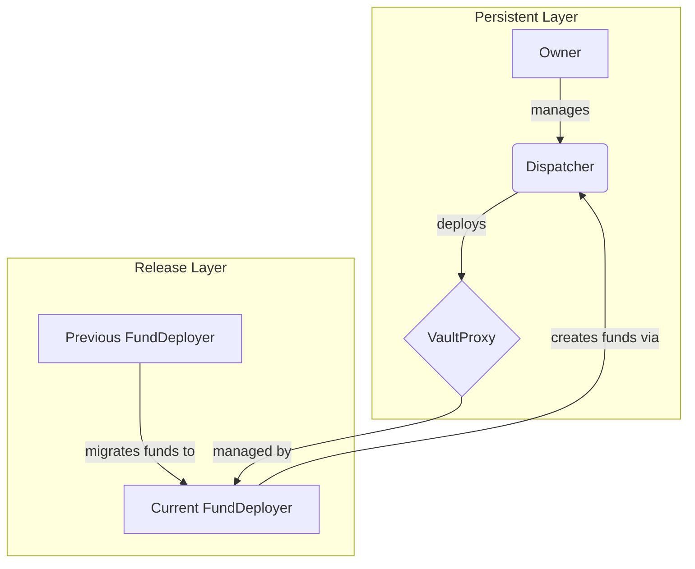

# Dispatcher Contract Documentation

## Overview

The `Dispatcher` contract is the foundational, persistent entry point of the Enzyme protocol. It is a singleton contract that remains constant across different versions of the protocol. Its primary responsibilities are to act as a factory for new funds (via `VaultProxy` contracts) and to manage the seamless upgradeability of the entire protocol by dispatching control to the current `FundDeployer` of a given release.

Think of it as the "kernel" of the Enzyme protocol: it handles the most critical, low-level tasks of fund creation and release management, ensuring a stable anchor point while the rest of the protocol evolves around it.

## State Variables

-   `currentFundDeployer` (`address`): The address of the active `FundDeployer` contract for the current protocol release. Only this contract is permitted to create new funds or signal migrations.
-   `nominatedOwner` (`address`): The address proposed to be the next owner of the `Dispatcher`. This facilitates a secure, two-step ownership transfer process.
-   `owner` (`address`): The current owner of the `Dispatcher`, holding administrative privileges for critical operations like upgrading the `FundDeployer`.
-   `migrationTimelock` (`uint256`): The mandatory waiting period (in seconds) between when a fund migration is signaled and when it can be executed. This acts as a security feature, giving fund managers time to review and react to an upcoming protocol upgrade. Defaults to `2 days`.
-   `sharesTokenSymbol` (`string`): The default token symbol (e.g., "ENZF") for the shares of newly deployed funds.
-   `vaultProxyToFundDeployer` (`mapping(address => address)`): A mapping that records which `FundDeployer` created which `VaultProxy`. This is crucial for managing the migration process from one release to another.
-   `vaultProxyToMigrationRequest` (`mapping(address => MigrationRequest)`): Stores the details of any pending migration for a `VaultProxy`.

---

## Structs

### `MigrationRequest`

This struct holds the necessary information for a fund's migration to a new protocol release.

```solidity
struct MigrationRequest {
    address nextFundDeployer;
    address nextVaultAccessor;
    address nextVaultLib;
    uint256 executableTimestamp;
}
```

-   `nextFundDeployer`: The address of the `FundDeployer` for the target release.
-   `nextVaultAccessor`: The address of the new `ComptrollerProxy` that will manage the fund after migration.
-   `nextVaultLib`: The address of the new `VaultLib` logic contract for the fund.
-   `executableTimestamp`: The `block.timestamp` at which the migration can be safely executed.

---

## Modifiers

### `onlyCurrentFundDeployer()`

This modifier restricts access to a function, ensuring it can only be called by the `address` stored in the `currentFundDeployer` state variable. It's used to protect functions that are core to the current release's operations, like deploying a new fund.

### `onlyOwner()`

This modifier restricts access to administrative functions, ensuring they can only be called by the `owner` of the `Dispatcher` contract.

---

## Function-by-Function Analysis

### `constructor()`
**Visibility:** `public`
**Purpose:** Initializes the `Dispatcher` contract upon its deployment.

**Line-by-Line Walkthrough:**
```solidity
constructor() public {
    // 1. Set the migration timelock to a default of 2 days. This provides a safety window for fund migrations.
    migrationTimelock = 2 days;
    // 2. Set the deployer of the contract as the initial owner. Ownership is required for administrative actions.
    owner = msg.sender;
    // 3. Set the default symbol for fund shares to "ENZF". This can be changed later by the owner.
    sharesTokenSymbol = "ENZF";
}
```

### `setSharesTokenSymbol()`
**Visibility:** `external`
**Purpose:** Allows the owner to change the default shares symbol for new funds.
**Access Control:** `onlyOwner`

**Parameters:**
- `_nextSymbol` (`string calldata`): The new symbol to be used for subsequently created funds.

**Line-by-Line Walkthrough:**
```solidity
function setSharesTokenSymbol(string calldata _nextSymbol) external override onlyOwner {
    // 1. Update the `sharesTokenSymbol` state variable with the new value provided.
    sharesTokenSymbol = _nextSymbol;

    // 2. Emit an event to log that the symbol has been changed, making the change transparent on-chain.
    emit SharesTokenSymbolSet(_nextSymbol);
}
```

### `claimOwnership()`
**Visibility:** `external`
**Purpose:** Allows the `nominatedOwner` to claim ownership of the contract, completing the two-step ownership transfer process.
**Access Control:** `nominatedOwner` only.

**Line-by-Line Walkthrough:**
```solidity
function claimOwnership() external override {
    // 1. Store the nominated owner's address in a local variable for security and gas efficiency.
    address nextOwner = nominatedOwner;
    // 2. Require that the caller (`msg.sender`) is the currently nominated owner.
    require(msg.sender == nextOwner, "claimOwnership: Only the nominatedOwner can call this function");

    // 3. Clear the `nominatedOwner` state variable, as the nomination has been fulfilled.
    delete nominatedOwner;

    // 4. Transfer ownership by updating the `owner` state variable.
    address prevOwner = owner;
    owner = nextOwner;

    // 5. Emit an event to log the ownership transfer.
    emit OwnershipTransferred(prevOwner, nextOwner);
}
```

### `removeNominatedOwner()`
**Visibility:** `external`
**Purpose:** Allows the current owner to revoke an ownership nomination before it is claimed.
**Access Control:** `onlyOwner`

**Line-by-Line Walkthrough:**
```solidity
function removeNominatedOwner() external override onlyOwner {
    // 1. Store the nominated owner's address in a local variable.
    address removedNominatedOwner = nominatedOwner;
    // 2. Check that there is a nominated owner to remove.
    require(removedNominatedOwner != address(0), "removeNominatedOwner: There is no nominated owner");

    // 3. Clear the `nominatedOwner` state variable.
    delete nominatedOwner;

    // 4. Emit an event to log the removal of the nomination.
    emit NominatedOwnerRemoved(removedNominatedOwner);
}
```

### `setCurrentFundDeployer()`
**Visibility:** `external`
**Purpose:** Upgrades the protocol to a new release by setting a new `FundDeployer` contract address.
**Access Control:** `onlyOwner`

**Parameters:**
- `_nextFundDeployer` (`address`): The address of the new `FundDeployer` contract.

**Line-by-Line Walkthrough:**
```solidity
function setCurrentFundDeployer(address _nextFundDeployer) external override onlyOwner {
    // 1. Validate that the new address is not the zero address.
    require(_nextFundDeployer != address(0), "setCurrentFundDeployer: _nextFundDeployer cannot be empty");
    // 2. Validate that the new address is a deployed contract.
    require(__isContract(_nextFundDeployer), "setCurrentFundDeployer: Non-contract _nextFundDeployer");

    // 3. Store the current FundDeployer address for the event log.
    address prevFundDeployer = currentFundDeployer;
    // 4. Ensure the new address is not the same as the current one.
    require(_nextFundDeployer != prevFundDeployer, "setCurrentFundDeployer: _nextFundDeployer is already currentFundDeployer");

    // 5. Update the `currentFundDeployer` state variable to the new address.
    currentFundDeployer = _nextFundDeployer;

    // 6. Emit an event to log the change.
    emit CurrentFundDeployerSet(prevFundDeployer, _nextFundDeployer);
}
```

### `setNominatedOwner()`
**Visibility:** `external`
**Purpose:** Nominates a new owner for the contract as the first step in a two-step ownership transfer.
**Access Control:** `onlyOwner`

**Parameters:**
- `_nextNominatedOwner` (`address`): The address to nominate as the next owner.

**Line-by-Line Walkthrough:**
```solidity
function setNominatedOwner(address _nextNominatedOwner) external override onlyOwner {
    // 1. Validate that the new nominated owner is not the zero address.
    require(_nextNominatedOwner != address(0), "setNominatedOwner: _nextNominatedOwner cannot be empty");
    // 2. Ensure the new nominee is not the current owner.
    require(_nextNominatedOwner != owner, "setNominatedOwner: _nextNominatedOwner is already the owner");
    // 3. Ensure the new nominee is not already the nominated owner.
    require(_nextNominatedOwner != nominatedOwner, "setNominatedOwner: _nextNominatedOwner is already nominated");

    // 4. Update the `nominatedOwner` state variable.
    nominatedOwner = _nextNominatedOwner;

    // 5. Emit an event to log the nomination.
    emit NominatedOwnerSet(_nextNominatedOwner);
}
```

### `deployVaultProxy()`
**Visibility:** `external`
**Purpose:** Deploys a new `VaultProxy` contract for a new fund. This is the primary factory function for creating funds.
**Access Control:** `onlyCurrentFundDeployer`

**Parameters:**
- `_vaultLib` (`address`): The address of the `VaultLib` logic contract for the new fund.
- `_owner` (`address`): The owner of the new fund.
- `_vaultAccessor` (`address`): The `ComptrollerProxy` that will manage the new fund.
- `_fundName` (`string calldata`): The name of the new fund.

**Returns:**
- `vaultProxy_` (`address`): The address of the newly deployed `VaultProxy`.

**Line-by-Line Walkthrough:**
```solidity
function deployVaultProxy(address _vaultLib, address _owner, address _vaultAccessor, string calldata _fundName)
    external override onlyCurrentFundDeployer returns (address vaultProxy_) {
    // 1. Ensure the accessor (ComptrollerProxy) is a contract, not an Externally Owned Account.
    require(__isContract(_vaultAccessor), "deployVaultProxy: Non-contract _vaultAccessor");

    // 2. Prepare the initialization data for the VaultProxy, which calls its `init` function upon deployment.
    bytes memory constructData = abi.encodeWithSelector(IMigratableVault.init.selector, _owner, _vaultAccessor, _fundName);

    // 3. Deploy a new VaultProxy contract, passing the initialization data and the logic library address.
    vaultProxy_ = address(new VaultProxy(constructData, _vaultLib));

    // 4. Get the `FundDeployer` address that is initiating this deployment.
    address fundDeployer = msg.sender;
    // 5. Record which FundDeployer created this fund. This is crucial for future migrations.
    vaultProxyToFundDeployer[vaultProxy_] = fundDeployer;

    // 6. Emit an event with the details of the new fund's deployment.
    emit VaultProxyDeployed(fundDeployer, _owner, vaultProxy_, _vaultLib, _vaultAccessor, _fundName);

    // 7. Return the address of the new fund's proxy contract.
    return vaultProxy_;
}
```

### `signalMigration()`
**Visibility:** `external`
**Purpose:** Initiates the migration process for a fund to the current release, creating a time-locked migration request.
**Access Control:** `onlyCurrentFundDeployer`

**Parameters:**
- `_vaultProxy` (`address`): The fund to be migrated.
- `_nextVaultAccessor` (`address`): The new `ComptrollerProxy` for the fund post-migration.
- `_nextVaultLib` (`address`): The new `VaultLib` for the fund post-migration.
- `_bypassFailure` (`bool`): A flag to ignore failures in migration hooks, used for edge cases.

**Line-by-Line Walkthrough:**
```solidity
function signalMigration(
    address _vaultProxy,
    address _nextVaultAccessor,
    address _nextVaultLib,
    bool _bypassFailure
) external override onlyCurrentFundDeployer {
    // 1. Ensure the new accessor is a contract.
    require(__isContract(_nextVaultAccessor), "signalMigration: Non-contract _nextVaultAccessor");

    // 2. Get the fund's original deployer from the mapping.
    address prevFundDeployer = vaultProxyToFundDeployer[_vaultProxy];
    require(prevFundDeployer != address(0), "signalMigration: _vaultProxy does not exist");

    // 3. Get the address of the new FundDeployer (the caller).
    address nextFundDeployer = msg.sender;
    // 4. Ensure the fund is migrating to a *new* release, not the same one.
    require(nextFundDeployer != prevFundDeployer, "signalMigration: Can only migrate to a new FundDeployer");

    // 5. Invoke the "PreSignal" hook on the old FundDeployer to allow it to perform any necessary pre-migration logic.
    __invokeMigrationOutHook(IMigrationHookHandler.MigrationOutHook.PreSignal, _vaultProxy, prevFundDeployer, nextFundDeployer, _nextVaultAccessor, _nextVaultLib, _bypassFailure);

    // 6. Calculate the timestamp when the migration will become executable.
    uint256 executableTimestamp = block.timestamp + migrationTimelock;
    // 7. Create and store the migration request in the mapping.
    vaultProxyToMigrationRequest[_vaultProxy] = MigrationRequest({
        nextFundDeployer: nextFundDeployer,
        nextVaultAccessor: _nextVaultAccessor,
        nextVaultLib: _nextVaultLib,
        executableTimestamp: executableTimestamp
    });

    // 8. Invoke the "PostSignal" hook on the old FundDeployer.
    __invokeMigrationOutHook(IMigrationHookHandler.MigrationOutHook.PostSignal, _vaultProxy, prevFundDeployer, nextFundDeployer, _nextVaultAccessor, _nextVaultLib, _bypassFailure);

    // 9. Emit an event to log the signaling of the migration.
    emit MigrationSignaled(_vaultProxy, prevFundDeployer, nextFundDeployer, _nextVaultAccessor, _nextVaultLib, executableTimestamp);
}
```

### `executeMigration()`
**Visibility:** `external`
**Purpose:** Finalizes a pending migration after the timelock has passed, upgrading the fund's contracts.
**Access Control:** The `nextFundDeployer` specified in the migration request.

**Parameters:**
- `_vaultProxy` (`address`): The fund to execute the migration for.
- `_bypassFailure` (`bool`): A flag to ignore failures in migration hooks.

**Line-by-Line Walkthrough:**
```solidity
function executeMigration(address _vaultProxy, bool _bypassFailure) external override {
    // 1. Load the migration request from storage into memory.
    MigrationRequest memory request = vaultProxyToMigrationRequest[_vaultProxy];
    address nextFundDeployer = request.nextFundDeployer;

    // 2. Check that a migration request actually exists for this fund.
    require(nextFundDeployer != address(0), "executeMigration: No migration request exists for _vaultProxy");
    // 3. Ensure the caller is the designated new FundDeployer from the request.
    require(msg.sender == nextFundDeployer, "executeMigration: Only the target FundDeployer can call this function");
    // 4. Double-check that the target FundDeployer is still the active, current release.
    require(nextFundDeployer == currentFundDeployer, "executeMigration: The target FundDeployer is no longer the current FundDeployer");

    // 5. Ensure the migration timelock has elapsed.
    uint256 executableTimestamp = request.executableTimestamp;
    require(block.timestamp >= executableTimestamp, "executeMigration: The migration timelock has not elapsed");

    // 6. Load remaining variables for the migration hooks and events.
    address prevFundDeployer = vaultProxyToFundDeployer[_vaultProxy];
    address nextVaultAccessor = request.nextVaultAccessor;
    address nextVaultLib = request.nextVaultLib;

    // 7. Invoke the "PreMigrate" hook on the old FundDeployer.
    __invokeMigrationOutHook(IMigrationHookHandler.MigrationOutHook.PreMigrate, _vaultProxy, prevFundDeployer, nextFundDeployer, nextVaultAccessor, nextVaultLib, _bypassFailure);

    // 8. **THE UPGRADE**: Set the new VaultLib on the fund's VaultProxy.
    IMigratableVault(_vaultProxy).setVaultLib(nextVaultLib);
    // 9. **THE UPGRADE**: Set the new accessor (ComptrollerProxy) on the fund's VaultProxy.
    IMigratableVault(_vaultProxy).setAccessor(nextVaultAccessor);

    // 10. Update the fund's deployer mapping to the new release.
    vaultProxyToFundDeployer[_vaultProxy] = nextFundDeployer;
    // 11. Clean up storage by deleting the completed migration request.
    delete vaultProxyToMigrationRequest[_vaultProxy];

    // 12. Invoke the "PostMigrate" hook on the old FundDeployer.
    __invokeMigrationOutHook(IMigrationHookHandler.MigrationOutHook.PostMigrate, _vaultProxy, prevFundDeployer, nextFundDeployer, nextVaultAccessor, nextVaultLib, _bypassFailure);

    // 13. Emit an event to log the successful execution of the migration.
    emit MigrationExecuted(_vaultProxy, prevFundDeployer, nextFundDeployer, nextVaultAccessor, nextVaultLib, executableTimestamp);
}
```

### `cancelMigration()`
**Visibility:** `external`
**Purpose:** Cancels a pending migration request before it has been executed.

**Parameters:**
- `_vaultProxy` (`address`): The fund for which to cancel the migration.
- `_bypassFailure` (`bool`): A flag to ignore failures in migration hooks.

**Line-by-Line Walkthrough:**
```solidity
function cancelMigration(address _vaultProxy, bool _bypassFailure) external override {
    // 1. Load the migration request.
    MigrationRequest memory request = vaultProxyToMigrationRequest[_vaultProxy];
    address nextFundDeployer = request.nextFundDeployer;
    // 2. Ensure a migration request exists.
    require(nextFundDeployer != address(0), "cancelMigration: No migration request exists");

    // 3. Ensure the caller is authorized (either the new FundDeployer or a designated migrator on the Vault).
    require(
        msg.sender == nextFundDeployer || IMigratableVault(_vaultProxy).canMigrate(msg.sender),
        "cancelMigration: Not an allowed caller"
    );

    // 4. Load remaining request details.
    address prevFundDeployer = vaultProxyToFundDeployer[_vaultProxy];
    address nextVaultAccessor = request.nextVaultAccessor;
    address nextVaultLib = request.nextVaultLib;
    uint256 executableTimestamp = request.executableTimestamp;

    // 5. Delete the migration request from storage.
    delete vaultProxyToMigrationRequest[_vaultProxy];

    // 6. Invoke the "PostCancel" hook on the old (outgoing) FundDeployer.
    __invokeMigrationOutHook(IMigrationHookHandler.MigrationOutHook.PostCancel, _vaultProxy, prevFundDeployer, nextFundDeployer, nextVaultAccessor, nextVaultLib, _bypassFailure);
    // 7. Invoke the cancellation hook on the new (incoming) FundDeployer to allow it to clean up (e.g., destruct the created Comptroller).
    __invokeMigrationInCancelHook(_vaultProxy, prevFundDeployer, nextFundDeployer, nextVaultAccessor, nextVaultLib, _bypassFailure);

    // 8. Emit an event to log the cancellation.
    emit MigrationCancelled(_vaultProxy, prevFundDeployer, nextFundDeployer, nextVaultAccessor, nextVaultLib, executableTimestamp);
}
```

### `setMigrationTimelock()`
**Visibility:** `external`
**Purpose:** Allows the owner to change the duration of the migration timelock.
**Access Control:** `onlyOwner`

**Parameters:**
- `_nextTimelock` (`uint256`): The new timelock duration in seconds.

**Line-by-Line Walkthrough:**
```solidity
function setMigrationTimelock(uint256 _nextTimelock) external override onlyOwner {
    // 1. Store the current timelock value.
    uint256 prevTimelock = migrationTimelock;
    // 2. Ensure the new timelock is different from the current one.
    require(_nextTimelock != prevTimelock, "setMigrationTimelock: _nextTimelock is the current timelock");

    // 3. Update the `migrationTimelock` state variable.
    migrationTimelock = _nextTimelock;

    // 4. Emit an event to log the change.
    emit MigrationTimelockSet(prevTimelock, _nextTimelock);
}
```

### `__isContract()`
**Visibility:** `private view`
**Purpose:** A helper function to check if an address has code deployed to it.

**Parameters:**
- `_who` (`address`): The address to check.

**Returns:**
- `isContract_` (`bool`): `true` if the address has contract code, `false` otherwise.

**Line-by-Line Walkthrough:**
```solidity
function __isContract(address _who) private view returns (bool isContract_) {
    // 1. Declare a variable to hold the size of the code at the address.
    uint256 size;
    // 2. Use inline assembly to access the `extcodesde` opcode, which returns the size of the code at a given address.
    assembly {
        size := extcodesize(_who)
    }

    // 3. If the code size is greater than 0, it's a contract.
    return size > 0;
}
```

### `__invokeMigrationInCancelHook()`
**Visibility:** `private`
**Purpose:** A helper to call a migration cancellation hook on the *incoming* `FundDeployer`, allowing it to perform cleanup.

**Line-by-Line Walkthrough:**
```solidity
function __invokeMigrationInCancelHook(
    address _vaultProxy,
    address _prevFundDeployer,
    address _nextFundDeployer,
    address _nextVaultAccessor,
    address _nextVaultLib,
    bool _bypassFailure
) private {
    // 1. Make a low-level .call to the incoming FundDeployer.
    (bool success, bytes memory returnData) = _nextFundDeployer.call(
        abi.encodeWithSelector(
            IMigrationHookHandler.invokeMigrationInCancelHook.selector,
            _vaultProxy,
            _prevFundDeployer,
            _nextVaultAccessor,
            _nextVaultLib
        )
    );
    // 2. If the call fails, either revert (if _bypassFailure is false) or emit an event and continue (if true).
    if (!success) {
        require(_bypassFailure, string(abi.encodePacked("MigrationOutCancelHook: ", returnData)));

        emit MigrationInCancelHookFailed(
            returnData, _vaultProxy, _prevFundDeployer, _nextFundDeployer, _nextVaultAccessor, _nextVaultLib
        );
    }
}
```

### `__invokeMigrationOutHook()`
**Visibility:** `private`
**Purpose:** A helper to call a migration hook on the *outgoing* `FundDeployer` at various stages of the migration process.

**Line-by-Line Walkthrough:**
```solidity
function __invokeMigrationOutHook(
    IMigrationHookHandler.MigrationOutHook _hook,
    address _vaultProxy,
    address _prevFundDeployer,
    address _nextFundDeployer,
    address _nextVaultAccessor,
    address _nextVaultLib,
    bool _bypassFailure
) private {
    // 1. Make a low-level .call to the outgoing FundDeployer.
    (bool success, bytes memory returnData) = _prevFundDeployer.call(
        abi.encodeWithSelector(
            IMigrationHookHandler.invokeMigrationOutHook.selector,
            _hook,
            _vaultProxy,
            _nextFundDeployer,
            _nextVaultAccessor,
            _nextVaultLib
        )
    );
    // 2. If the call fails, either revert or emit an event, based on `_bypassFailure`.
    if (!success) {
        require(_bypassFailure, string(abi.encodePacked(__migrationOutHookFailureReasonPrefix(_hook), returnData)));

        emit MigrationOutHookFailed(
            returnData, _hook, _vaultProxy, _prevFundDeployer, _nextFundDeployer, _nextVaultAccessor, _nextVaultLib
        );
    }
}
```

### `__migrationOutHookFailureReasonPrefix()`
**Visibility:** `private pure`
**Purpose:** A helper to return a descriptive error message prefix for a failing migration hook.

**Line-by-Line Walkthrough:**
```solidity
function __migrationOutHookFailureReasonPrefix(IMigrationHookHandler.MigrationOutHook _hook)
    private
    pure
    returns (string memory failureReasonPrefix_)
{
    // 1. Based on the hook type, return a specific error string prefix. This makes debugging reverts much easier.
    if (_hook == IMigrationHookHandler.MigrationOutHook.PreSignal) {
        return "MigrationOutHook.PreSignal: ";
    }
    if (_hook == IMigrationHookHandler.MigrationOutHook.PostSignal) {
        return "MigrationOutHook.PostSignal: ";
    }
    if (_hook == IMigrationHookHandler.MigrationOutHook.PreMigrate) {
        return "MigrationOutHook.PreMigrate: ";
    }
    if (_hook == IMigrationHookHandler.MigrationOutHook.PostMigrate) {
        return "MigrationOutHook.PostMigrate: ";
    }
    if (_hook == IMigrationHookHandler.MigrationOutHook.PostCancel) {
        return "MigrationOutHook.PostCancel: ";
    }

    return "";
}
```
---
## Mermaid Diagram


