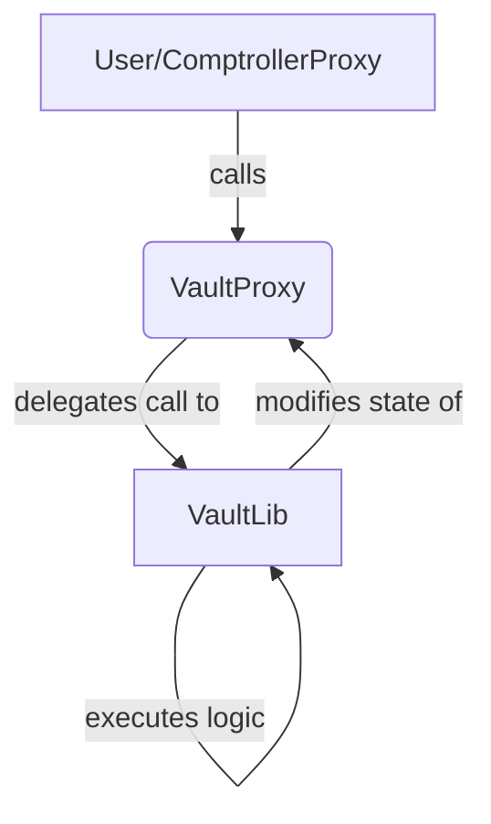

# VaultProxy and VaultLib Contract Documentation

## Overview

The `VaultProxy` and `VaultLib` contracts are the heart of an Enzyme fund, responsible for holding assets and managing the fund's state.

*   **`VaultProxy`:** A minimal, EIP-1822 compliant proxy that holds the fund's assets and delegates all calls to the `VaultLib`. This separation of data and logic is what makes the protocol upgradeable.
*   **`VaultLib`:** The logic contract for the fund, containing all the core functions for asset management, share accounting, and access control.

## `VaultProxy`

### `constructor()`
**Visibility:** `public`
**Purpose:** Initializes the proxy, setting its initial `VaultLib` implementation.
```solidity
constructor(bytes memory _constructData, address _vaultLib) public {
    // 1. Check a unique identifier (`proxiableUUID`) on the _vaultLib to ensure it's a valid VaultLib.
    require(
        bytes32(0x027b9570e9fedc1a80b937ae9a06861e5faef3992491af30b684a64b3fbec7a5)
            == IProxiableVaultLib(_vaultLib).proxiableUUID(),
        "constructor: _vaultLib not compatible"
    );

    // 2. Using inline assembly, set the implementation address in the EIP-1967 storage slot.
    assembly {
        sstore(0x360894a13ba1a3210667c828492db98dca3e2076cc3735a920a3ca505d382bbc, _vaultLib)
    }

    // 3. Make a delegatecall to the `_vaultLib` with the `_constructData` to initialize the proxy's state.
    (bool success, bytes memory returnData) = _vaultLib.delegatecall(_constructData);
    require(success, string(returnData));
}
```

### `fallback()`
**Visibility:** `external payable`
**Purpose:** Delegates all calls made to the proxy to the current `VaultLib` implementation.
```solidity
fallback() external payable {
    assembly {
        // 1. Load the address of the VaultLib implementation from the EIP-1967 storage slot.
        let contractLogic := sload(0x360894a13ba1a3210667c828492db98dca3e2076cc3735a920a3ca505d382bbc)
        // 2. Copy the incoming call data to memory.
        calldatacopy(0x0, 0x0, calldatasize())
        // 3. Execute the call on the implementation contract using `delegatecall`, preserving `msg.sender` and `msg.value`.
        let success := delegatecall(sub(gas(), 10000), contractLogic, 0x0, calldatasize(), 0, 0)
        // 4. Copy the return data from the implementation call.
        let retSz := returndatasize()
        returndatacopy(0, 0, retSz)
        // 5. Bubble up the result of the call: revert if the delegatecall failed, or return the data if it succeeded.
        switch success
        case 0 { revert(0, retSz) }
        default { return(0, retSz) }
    }
}
```

## `VaultLib`

### `init()`
**Visibility:** `external`
**Purpose:** Initializes the fund's core parameters. This function acts as a constructor for the proxy.
```solidity
function init(address _owner, address _accessor, string calldata _fundName) external override {
    // 1. Ensure this function is only called once by checking if `creator` has been set.
    require(creator == address(0), "init: Proxy already initialized");
    // 2. Set the creator of the fund (the Dispatcher).
    creator = msg.sender;
    // 3. Set the name of the fund's shares token.
    sharesName = _fundName;

    // 4. Set the initial accessor (ComptrollerProxy) and owner of the fund.
    __setAccessor(_accessor);
    __setOwner(_owner);

    // 5. Emit an event to log the setting of the initial VaultLib.
    emit VaultLibSet(address(0), getVaultLib());
}
```

### `setAccessor()` / `setVaultLib()`
**Visibility:** `external`
**Purpose:** These functions are used to manage the fund's upgradeability. `setAccessor` is called during a reconfiguration, and `setVaultLib` is called during a full migration.
**Access Control:** `creator` (the `Dispatcher`) only.
```solidity
function setAccessor(address _nextAccessor) external override {
    // 1. Only the `creator` (the Dispatcher) can change the accessor.
    require(msg.sender == creator, "setAccessor: Only callable by the contract creator");
    // 2. Call the internal helper to update the accessor.
    __setAccessor(_nextAccessor);
}
```

### `__setAccessor()`
**Visibility:** `internal`
**Purpose:** Sets the `accessor` (the `ComptrollerProxy`) of the fund.
```solidity
function __setAccessor(address _nextAccessor) internal {
    // 1. Ensure the new accessor is not the zero address.
    require(_nextAccessor != address(0), "__setAccessor: _nextAccessor cannot be empty");
    // 2. Store the current accessor to emit in the event.
    address prevAccessor = accessor;
    // 3. Update the accessor state variable.
    accessor = _nextAccessor;
    // 4. Emit an event to log the change.
    emit AccessorSet(prevAccessor, _nextAccessor);
}
```

### `__setOwner()`
**Visibility:** `internal`
**Purpose:** Sets the owner of the fund.
```solidity
function __setOwner(address _nextOwner) internal {
    // 1. Ensure the new owner is not the zero address.
    require(_nextOwner != address(0), "__setOwner: _nextOwner cannot be empty");
    // 2. Store the current owner for the event.
    address prevOwner = owner;
    // 3. Ensure the new owner is not the same as the current owner.
    require(_nextOwner != prevOwner, "__setOwner: _nextOwner is the current owner");
    // 4. Update the owner state variable.
    owner = _nextOwner;
    // 5. Emit an event to log the change.
    emit OwnerSet(prevOwner, _nextOwner);
}
```
---
## Mermaid Diagram

