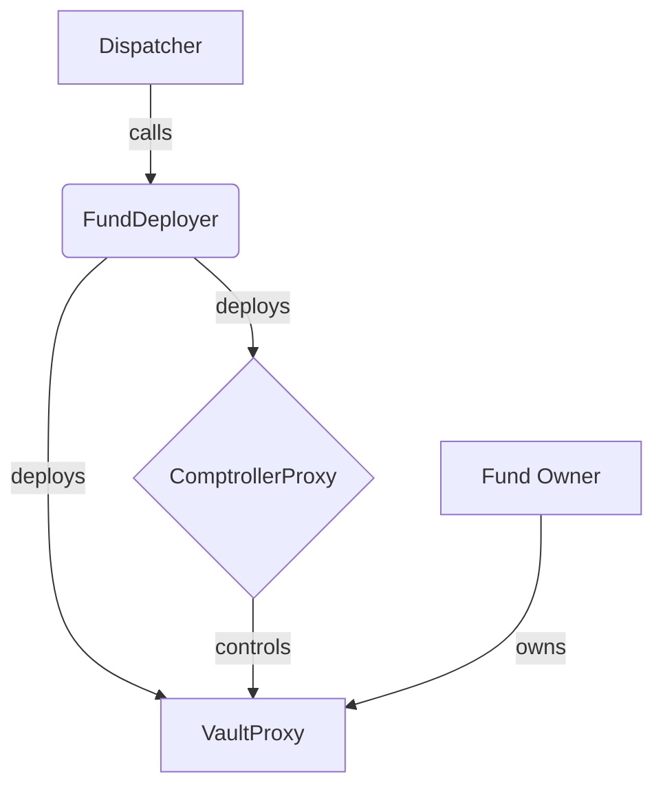

# FundDeployer Contract Documentation

## Overview

The `FundDeployer` is the primary contract for a specific release of the Enzyme protocol. It's responsible for creating new funds, managing their configurations, and handling migrations both into and out of its release. Each protocol release has its own `FundDeployer`.

## Function-by-Function Analysis

### `constructor()`
**Visibility:** `public`
**Purpose:** Initializes the `FundDeployer` with critical addresses and default values.
```solidity
constructor(address _dispatcher, address _gasRelayPaymasterFactory)
    public
    GasRelayRecipientMixin(_gasRelayPaymasterFactory)
{
    // 1. Set the deployer of the contract as the creator. The creator has initial ownership privileges.
    CREATOR = msg.sender;
    // 2. Set the immutable address of the Dispatcher contract.
    DISPATCHER = _dispatcher;

    // 3. Set default gas limits for the destructActivated function. These are estimates to ensure migration-out logic can complete.
    gasLimitForDestructCallToDeactivateFeeManager = 300000;
    gasLimitForDestructCallToPayProtocolFee = 200000;

    // 4. Set the default timelock for intra-release reconfigurations.
    reconfigurationTimelock = 2 days;
}
```

### `setComptrollerLib()` / `setProtocolFeeTracker()` / `setVaultLib()`
**Visibility:** `external`
**Purpose:** These functions are used to set the addresses of the core libraries and contracts for the release. They are "pseudo-constant" and can only be called once.
**Access Control:** `onlyOwner` (which is the `CREATOR` before the release is live).
```solidity
function setComptrollerLib(address _comptrollerLib)
    external override onlyOwner pseudoConstant(getComptrollerLib()) {
    // 1. The pseudoConstant modifier ensures this function can only be called if `comptrollerLib` is address(0).
    // 2. Set the address of the ComptrollerLib for this release.
    comptrollerLib = _comptrollerLib;
    // 3. Emit an event to log the change.
    emit ComptrollerLibSet(_comptrollerLib);
}
```

### `setReleaseLive()`
**Visibility:** `external`
**Purpose:** Finalizes the release setup and makes it "live," enabling fund creation and migration.
**Access Control:** `CREATOR` only.
```solidity
function setReleaseLive() external override {
    // 1. Only the original creator of the contract can call this function.
    require(msg.sender == getCreator(), "setReleaseLive: Only the creator can call this function");
    // 2. Ensure the release is not already live to prevent re-initialization.
    require(!releaseIsLive(), "setReleaseLive: Already live");

    // 3. Ensure all necessary library and contract addresses have been set.
    require(getComptrollerLib() != address(0), "setReleaseLive: comptrollerLib is not set");
    require(getProtocolFeeTracker() != address(0), "setReleaseLive: protocolFeeTracker is not set");
    require(getVaultLib() != address(0), "setReleaseLive: vaultLib is not set");

    // 4. Set the `isLive` flag to true.
    isLive = true;

    // 5. Emit an event to signal that the release is now live.
    emit ReleaseIsLive();
}
```

### `createNewFund()`
**Visibility:** `external`
**Purpose:** Creates a new fund from scratch.
**Access Control:** `onlyLiveRelease`
```solidity
function createNewFund(
    address _fundOwner,
    string calldata _fundName,
    string calldata _fundSymbol,
    address _denominationAsset,
    uint256 _sharesActionTimelock,
    bytes calldata _feeManagerConfigData,
    bytes calldata _policyManagerConfigData
) external override onlyLiveRelease returns (address comptrollerProxy_, address vaultProxy_) {
    // 1. Get the canonical sender of the transaction.
    address canonicalSender = __msgSender();

    // 2. Deploy a new ComptrollerProxy for the fund's logic.
    comptrollerProxy_ = __deployComptrollerProxy(canonicalSender, _denominationAsset, _sharesActionTimelock);

    // 3. Deploy a new VaultProxy for the fund's assets via the Dispatcher.
    vaultProxy_ = __deployVaultProxy(_fundOwner, comptrollerProxy_, _fundName, _fundSymbol);

    // 4. Link the two proxies together by setting the VaultProxy address on the ComptrollerProxy.
    IComptroller(comptrollerProxy_).setVaultProxy(vaultProxy_);

    // 5. Configure all the extensions (fees, policies, etc.) for the new fund.
    __configureExtensions(comptrollerProxy_, vaultProxy_, _feeManagerConfigData, _policyManagerConfigData);

    // 6. Activate the fund's logic. This is the final step before the fund is operational.
    IComptroller(comptrollerProxy_).activate(false); // `false` because it's not a migration

    // 7. Initialize the fund with the protocol fee tracker.
    IProtocolFeeTracker(getProtocolFeeTracker()).initializeForVault(vaultProxy_);

    // 8. Emit an event to log the creation of the new fund.
    emit NewFundCreated(canonicalSender, vaultProxy_, comptrollerProxy_);

    // 9. Return the addresses of the new proxies.
    return (comptrollerProxy_, vaultProxy_);
}
```

### `createMigrationRequest()`
**Visibility:** `external`
**Purpose:** Prepares an existing fund (from a previous release) for migration to this release.
**Access Control:** `onlyLiveRelease`, `onlyMigratorNotRelayable`
```solidity
function createMigrationRequest(
    address _vaultProxy,
    address _denominationAsset,
    uint256 _sharesActionTimelock,
    bytes calldata _feeManagerConfigData,
    bytes calldata _policyManagerConfigData,
    bool _bypassPrevReleaseFailure
) external override onlyLiveRelease onlyMigratorNotRelayable(_vaultProxy) returns (address comptrollerProxy_) {
    // 1. Check with the Dispatcher that a migration request doesn't already exist for this fund.
    require(!IDispatcher(getDispatcher()).hasMigrationRequest(_vaultProxy), "createMigrationRequest: A MigrationRequest already exists");

    // 2. Deploy a new ComptrollerProxy for the fund's new logic in this release.
    comptrollerProxy_ = __deployComptrollerProxy(msg.sender, _denominationAsset, _sharesActionTimelock);

    // 3. Link the new Comptroller to the existing VaultProxy.
    IComptroller(comptrollerProxy_).setVaultProxy(_vaultProxy);

    // 4. Configure the extensions for the fund's new setup.
    __configureExtensions(comptrollerProxy_, _vaultProxy, _feeManagerConfigData, _policyManagerConfigData);

    // 5. Signal the migration to the Dispatcher. This creates the time-locked request.
    IDispatcher(getDispatcher()).signalMigration(_vaultProxy, comptrollerProxy_, getVaultLib(), _bypassPrevReleaseFailure);

    // 6. Emit an event to log the creation of the migration request.
    emit MigrationRequestCreated(msg.sender, _vaultProxy, comptrollerProxy_);

    // 7. Return the address of the newly created ComptrollerProxy.
    return comptrollerProxy_;
}
```

### `__deployComptrollerProxy()`
**Visibility:** `private`
**Purpose:** A helper function to deploy and initialize a `ComptrollerProxy`.
```solidity
function __deployComptrollerProxy(
    address _canonicalSender,
    address _denominationAsset,
    uint256 _sharesActionTimelock
) private returns (address comptrollerProxy_) {
    // 1. Prepare the initialization data for the ComptrollerProxy's `init` function.
    bytes memory constructData =
        abi.encodeWithSelector(IComptroller.init.selector, _denominationAsset, _sharesActionTimelock);
    // 2. Deploy a new ComptrollerProxy, passing the init data and the shared ComptrollerLib address for this release.
    comptrollerProxy_ = address(new ComptrollerProxy(constructData, getComptrollerLib()));
    // 3. Emit an event to log the deployment.
    emit ComptrollerProxyDeployed(_canonicalSender, comptrollerProxy_, _denominationAsset, _sharesActionTimelock);
}
```

### `__configureExtensions()`
**Visibility:** `private`
**Purpose:** A helper to set the configuration for all extensions on a new or migrating fund.
```solidity
function __configureExtensions(
    address _comptrollerProxy,
    address _vaultProxy,
    bytes memory _feeManagerConfigData,
    bytes memory _policyManagerConfigData
) private {
    // 1. Configure the FeeManager if config data is provided.
    if (_feeManagerConfigData.length > 0) {
        IExtension(IComptroller(_comptrollerProxy).getFeeManager()).setConfigForFund(
            _comptrollerProxy, _vaultProxy, _feeManagerConfigData
        );
    }
    // 2. Configure the other managers. These calls cache the validated VaultProxy for the ComptrollerProxy, even with empty data.
    IExtension(IComptroller(_comptrollerProxy).getExternalPositionManager()).setConfigForFund(_comptrollerProxy, _vaultProxy, "");
    IExtension(IComptroller(_comptrollerProxy).getIntegrationManager()).setConfigForFund(_comptrollerProxy, _vaultProxy, "");
    IExtension(IComptroller(_comptrollerProxy).getPolicyManager()).setConfigForFund(_comptrollerProxy, _vaultProxy, _policyManagerConfigData);
}
```
---
## Mermaid Diagram

