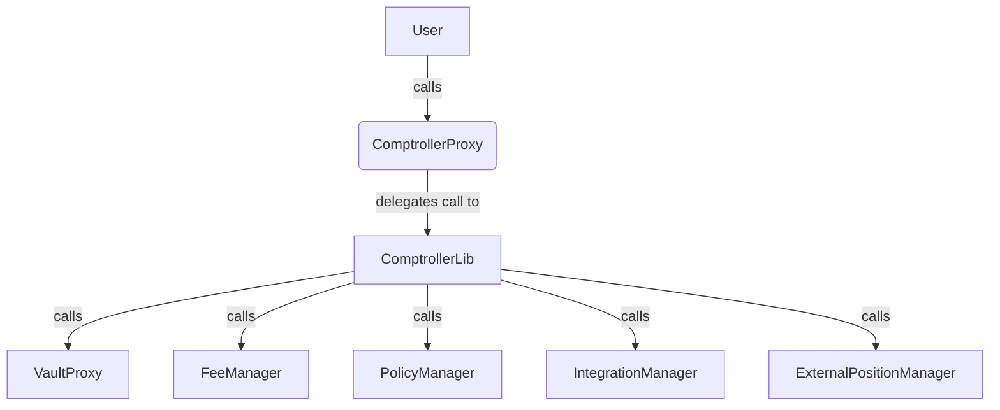

# ComptrollerProxy and ComptrollerLib Contract Documentation

## Overview

The `ComptrollerProxy` and `ComptrollerLib` contracts are the control center for each Enzyme fund.

*   **`ComptrollerProxy`:** A non-upgradeable proxy that delegates all logic to a shared `ComptrollerLib` instance for the release.
*   **`ComptrollerLib`:** The logic contract for all funds in a release, handling all fund-level actions.

## `ComptrollerLib`

### `init()`
**Visibility:** `external`
**Purpose:** Initializes the `ComptrollerProxy`'s state variables. Acts as a constructor for the proxy.
```solidity
function init(address _denominationAsset, uint256 _sharesActionTimelock) external override {
    require(getDenominationAsset() == address(0), "init: Already initialized");
    require(IValueInterpreter(getValueInterpreter()).isSupportedPrimitiveAsset(_denominationAsset), "init: Bad denomination asset");
    denominationAsset = _denominationAsset;
    sharesActionTimelock = _sharesActionTimelock;
}
```

### `callOnExtension()`
**Visibility:** `external`
**Purpose:** The central router for all actions that involve extensions.
```solidity
function callOnExtension(address _extension, uint256 _actionId, bytes calldata _callArgs)
    external override locksReentrance allowsPermissionedVaultAction {
    require(
        _extension == getFeeManager() || _extension == getIntegrationManager()
            || _extension == getExternalPositionManager(), "callOnExtension: _extension invalid"
    );
    IExtension(_extension).receiveCallFromComptroller(__msgSender(), _actionId, _callArgs);
}
```

### `buyShares()` and `__buyShares()`
**Visibility:** `external` and `private`
**Purpose:** Handles the purchase of fund shares. `buyShares` is the public entry point, which calls the internal `__buyShares` for the core logic.
```solidity
function __buyShares(
    address _buyer,
    uint256 _investmentAmount,
    uint256 _minSharesQuantity,
    bool _hasSharesActionTimelock,
    address _canonicalSender
) private locksReentrance allowsPermissionedVaultAction returns (uint256 sharesReceived_) {
    require(_minSharesQuantity > 0, "__buyShares: _minSharesQuantity must be >0");
    address vaultProxyCopy = getVaultProxy();
    uint256 gav = calcGav();
    __preBuySharesHook(_buyer, _investmentAmount, gav);
    IVault(vaultProxyCopy).payProtocolFee();
    uint256 receivedInvestmentAmount = __transferFromWithReceivedAmount(getDenominationAsset(), _canonicalSender, vaultProxyCopy, _investmentAmount);
    uint256 sharePrice = __calcGrossShareValue(gav, ERC20(vaultProxyCopy).totalSupply(), 10 ** uint256(ERC20(getDenominationAsset()).decimals()));
    uint256 sharesIssued = receivedInvestmentAmount.mul(SHARES_UNIT).div(sharePrice);
    uint256 prevBuyerShares = ERC20(vaultProxyCopy).balanceOf(_buyer);
    IVault(vaultProxyCopy).mintShares(_buyer, sharesIssued);
    __postBuySharesHook(_buyer, receivedInvestmentAmount, sharesIssued, gav);
    sharesReceived_ = ERC20(vaultProxyCopy).balanceOf(_buyer).sub(prevBuyerShares);
    require(sharesReceived_ >= _minSharesQuantity, "__buyShares: Shares received < _minSharesQuantity");
    if (_hasSharesActionTimelock) {
        acctToLastSharesBoughtTimestamp[_buyer] = block.timestamp;
    }
    emit SharesBought(_buyer, receivedInvestmentAmount, sharesIssued, sharesReceived_);
}
```

### `redeemSharesInKind()`
**Visibility:** `external`
**Purpose:** Redeems a quantity of shares for a proportional slice of all assets held by the fund.
```solidity
function redeemSharesInKind(
    address _recipient,
    uint256 _sharesQuantity,
    address[] calldata _additionalAssets,
    address[] calldata _assetsToSkip
) external override locksReentrance returns (address[] memory payoutAssets_, uint256[] memory payoutAmounts_) {
    address canonicalSender = __msgSender();
    payoutAssets_ = __parseRedemptionPayoutAssets(IVault(vaultProxy).getTrackedAssets(), _additionalAssets, _assetsToSkip);
    (uint256 sharesToRedeem, uint256 sharesSupply) =
        __redeemSharesSetup(IVault(vaultProxy), canonicalSender, _sharesQuantity, false, 0); // GAV is 0 as it's not needed for proportional redemption
    payoutAmounts_ = new uint256[](payoutAssets_.length);
    for (uint256 i; i < payoutAssets_.length; i++) {
        payoutAmounts_[i] = ERC20(payoutAssets_[i]).balanceOf(vaultProxy).mul(sharesToRedeem).div(sharesSupply);
        if (payoutAmounts_[i] > 0) {
            IVault(vaultProxy).withdrawAssetTo(payoutAssets_[i], _recipient, payoutAmounts_[i]);
        }
    }
    emit SharesRedeemed(canonicalSender, _recipient, sharesToRedeem, payoutAssets_, payoutAmounts_);
}
```

### `redeemSharesForSpecificAssets()`
**Visibility:** `external`
**Purpose:** Redeems a quantity of shares for specific assets designated by the user.
```solidity
function redeemSharesForSpecificAssets(
    address _recipient,
    uint256 _sharesQuantity,
    address[] calldata _payoutAssets,
    uint256[] calldata _payoutAssetPercentages
) external override locksReentrance returns (uint256[] memory payoutAmounts_) {
    address canonicalSender = __msgSender();
    require(_payoutAssets.length == _payoutAssetPercentages.length, "redeemSharesForSpecificAssets: Unequal arrays");
    require(_payoutAssets.isUniqueSet(), "redeemSharesForSpecificAssets: Duplicate payout asset");

    uint256 gav = calcGav();
    (uint256 sharesToRedeem, uint256 sharesSupply) =
        __redeemSharesSetup(IVault(getVaultProxy()), canonicalSender, _sharesQuantity, true, gav);

    // Calculate the total GAV owed to the redeemer for their shares.
    uint256 owedGav = gav.mul(sharesToRedeem).div(sharesSupply);

    // Payout the specified assets based on the provided percentages of the owed GAV.
    payoutAmounts_ = __payoutSpecifiedAssetPercentages(
        IVault(getVaultProxy()),
        _recipient,
        _payoutAssets,
        _payoutAssetPercentages,
        owedGav
    );

    // Run post-redemption policy hooks.
    __postRedeemSharesForSpecificAssetsHook(
        canonicalSender, _recipient, sharesToRedeem, _payoutAssets, payoutAmounts_, gav
    );

    emit SharesRedeemed(canonicalSender, _recipient, sharesToRedeem, _payoutAssets, payoutAmounts_);
}
```
---
## Mermaid Diagram


