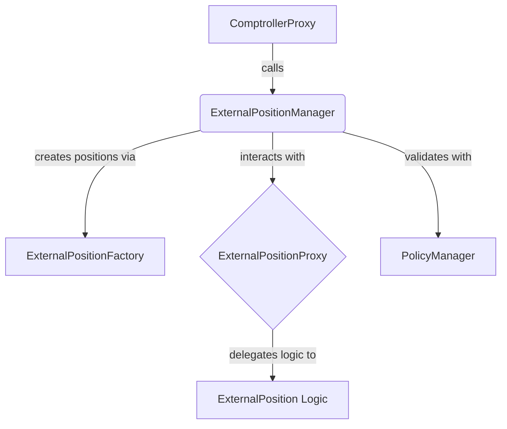

# ExternalPositionManager Contract Documentation

## Overview

The `ExternalPositionManager` is a specialized extension for handling "external positions"—complex assets that are more than just simple ERC20 tokens, such as LP positions, staking positions, or Yearn Vault shares. It provides a structured way to create, interact with, and manage the lifecycle of these positions.

## Function-by-Function Analysis

### `receiveCallFromComptroller()`
**Visibility:** `external`
**Purpose:** The main entry point for all actions routed from the `ComptrollerProxy`. It decodes the action ID and dispatches the call to the appropriate internal function.
```solidity
function receiveCallFromComptroller(address _caller, uint256 _actionId, bytes calldata _callArgs)
    external override {
    // 1. Get the ComptrollerProxy and VaultProxy addresses.
    address comptrollerProxy = msg.sender;
    address vaultProxy = getVaultProxyForFund(comptrollerProxy);
    require(vaultProxy != address(0), "receiveCallFromComptroller: Fund is not valid");

    // 2. Ensure the original caller is authorized to manage the fund's assets.
    require(IVault(vaultProxy).canManageAssets(_caller), "receiveCallFromComptroller: Unauthorized");

    // 3. Dispatch to the correct internal function based on the action ID.
    if (_actionId == uint256(ExternalPositionManagerActions.CreateExternalPosition)) {
        __createExternalPosition(_caller, comptrollerProxy, vaultProxy, _callArgs);
    } else if (_actionId == uint256(ExternalPositionManagerActions.CallOnExternalPosition)) {
        (address externalPosition, uint256 actionId, bytes memory actionArgs) =
            __decodeCallOnExternalPositionCallArgs(_callArgs);
        __executeCallOnExternalPosition(_caller, comptrollerProxy, externalPosition, actionId, actionArgs);
    } else if (_actionId == uint256(ExternalPositionManagerActions.RemoveExternalPosition)) {
        __executeRemoveExternalPosition(_caller, comptrollerProxy, _callArgs);
    } else if (_actionId == uint256(ExternalPositionManagerActions.ReactivateExternalPosition)) {
        __reactivateExternalPosition(_caller, comptrollerProxy, vaultProxy, _callArgs);
    } else {
        revert("receiveCallFromComptroller: Invalid _actionId");
    }
}
```

### `__createExternalPosition()`
**Visibility:** `private`
**Purpose:** Creates a new external position proxy, initializes it, and links it to the fund.
```solidity
function __createExternalPosition(
    address _caller,
    address _comptrollerProxy,
    address _vaultProxy,
    bytes memory _callArgs
) private {
    // 1. Decode the arguments: the type ID for the position, its initialization data, and any initial action to take.
    (uint256 typeId, bytes memory initializationData, bytes memory callOnExternalPositionCallArgs) =
        abi.decode(_callArgs, (uint256, bytes, bytes));

    // 2. Get the "parser" contract for this type of position.
    address parser = getExternalPositionParserForType(typeId);
    require(parser != address(0), "__createExternalPosition: Invalid typeId");

    // 3. Validate the creation action against the fund's policies.
    IPolicyManager(getPolicyManager()).validatePolicies(
        _comptrollerProxy,
        IPolicyManager.PolicyHook.CreateExternalPosition,
        abi.encode(_caller, typeId, initializationData)
    );

    // 4. Use the parser to prepare the specific initialization arguments for this position type.
    bytes memory initArgs = IExternalPositionParser(parser).parseInitArgs(_vaultProxy, initializationData);

    // 5. Prepare the constructor data for the generic external position proxy.
    bytes memory constructData = abi.encodeWithSelector(IExternalPosition.init.selector, initArgs);

    // 6. Deploy the external position proxy via the persistent `ExternalPositionFactory`.
    address externalPosition = IExternalPositionFactory(EXTERNAL_POSITION_FACTORY).deploy(
        _vaultProxy, typeId, getExternalPositionLibForType(typeId), constructData
    );

    // 7. Add the new position to the fund's list of active external positions.
    __addExternalPosition(_comptrollerProxy, externalPosition);

    // 8. If an initial action was specified, execute it.
    if (callOnExternalPositionCallArgs.length != 0) {
        (, uint256 actionId, bytes memory actionArgs) =
            __decodeCallOnExternalPositionCallArgs(callOnExternalPositionCallArgs);
        __executeCallOnExternalPosition(_caller, _comptrollerProxy, externalPosition, actionId, actionArgs);
    }
}
```
---
## Mermaid Diagram


