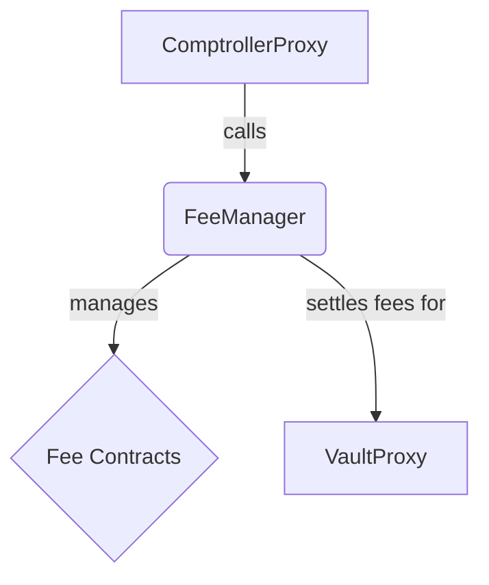

# FeeManager Contract Documentation

## Overview

The `FeeManager` is an extension responsible for handling all fee-related logic for a fund. It allows for the registration of various fee contracts and ensures they are settled at the appropriate times during a fund's lifecycle.

## Function-by-Function Analysis

### `setConfigForFund()`
**Visibility:** `external`
**Purpose:** Configures the fees for a fund during its setup or reconfiguration.
**Access Control:** `onlyFundDeployer`
```solidity
function setConfigForFund(address _comptrollerProxy, address _vaultProxy, bytes calldata _configData)
    external override onlyFundDeployer {
    // 1. Cache the VaultProxy address for the given ComptrollerProxy to establish their link.
    __setValidatedVaultProxy(_comptrollerProxy, _vaultProxy);

    // 2. Decode the configuration data into an array of fee contracts and their individual settings data.
    (address[] memory fees, bytes[] memory settingsData) = abi.decode(_configData, (address[], bytes[]));

    // 3. Sanity check: ensure the arrays are of equal length and fees are unique to prevent misconfigurations.
    require(fees.length == settingsData.length, "setConfigForFund: fees and settingsData array lengths unequal");
    require(fees.isUniqueSet(), "setConfigForFund: fees cannot include duplicates");

    // 4. Loop through each fee, call the fee contract to add the fund-specific settings, and then enable the fee for the fund.
    for (uint256 i; i < fees.length; i++) {
        IFee(fees[i]).addFundSettings(_comptrollerProxy, settingsData[i]);
        comptrollerProxyToFees[_comptrollerProxy].push(fees[i]);
        emit FeeEnabledForFund(_comptrollerProxy, fees[i], settingsData[i]);
    }
}
```

### `invokeHook()`
**Visibility:** `external`
**Purpose:** A generic "hook" that is called by the `ComptrollerLib` at specific points in the fund's lifecycle (e.g., `PreBuyShares`). It settles and updates all fees registered for that hook.
```solidity
function invokeHook(FeeHook _hook, bytes calldata _settlementData, uint256 _gav) external override {
    // 1. Calls the internal `__invokeHook` function, passing the ComptrollerProxy (msg.sender) and other params. The `true` flag indicates that `update()` should be called on fees after `settle()`.
    __invokeHook(msg.sender, _hook, _settlementData, _gav, true);
}
```

### `__invokeHook()`
**Visibility:** `private`
**Purpose:** The internal logic for `invokeHook`, orchestrating the settlement and updating of fees.
```solidity
function __invokeHook(
    address _comptrollerProxy,
    FeeHook _hook,
    bytes memory _settlementData,
    uint256 _gavOrZero,
    bool _updateFees
) private {
    // 1. Get the list of enabled fees for the fund. If none, return early.
    address[] memory fees = getEnabledFeesForFund(_comptrollerProxy);
    if (fees.length == 0) { return; }

    // 2. Get the VaultProxy address.
    address vaultProxy = getVaultProxyForFund(_comptrollerProxy);
    require(vaultProxy != address(0), "__invokeHook: Fund is not active");

    // 3. First, settle all fees for the hook. This may result in minting/burning/transferring shares. `__settleFees` returns the GAV if it was calculated.
    uint256 gav = __settleFees(_comptrollerProxy, vaultProxy, fees, _hook, _settlementData, _gavOrZero);

    // 4. Second, if requested, call `update()` on all fees for the hook. This allows fees to update their internal state after all settlements are complete.
    if (_updateFees) {
        __updateFees(_comptrollerProxy, vaultProxy, fees, _hook, _settlementData, gav);
    }
}
```

### `__settleFee()`
**Visibility:** `private`
**Purpose:** The internal logic for settling a single fee and applying its result to the fund's state.
```solidity
function __settleFee(
    address _comptrollerProxy,
    address _vaultProxy,
    address _fee,
    FeeHook _hook,
    bytes memory _settlementData,
    uint256 _gav
) private {
    // 1. Call the `settle` function on the specific fee contract to determine what action to take.
    (SettlementType settlementType, address payer, uint256 sharesDue) =
        IFee(_fee).settle(_comptrollerProxy, _vaultProxy, _hook, _settlementData, _gav);

    // 2. If the fee returns `SettlementType.None`, no action is needed.
    if (settlementType == SettlementType.None) { return; }

    // 3. Based on the returned `settlementType`, perform the appropriate shares action (mint, burn, transfer, etc.).
    address payee;
    if (settlementType == SettlementType.Direct) {
        payee = __parseFeeRecipientForFund(_comptrollerProxy, _vaultProxy, _fee);
        __transferShares(_comptrollerProxy, payer, payee, sharesDue);
    } else if (settlementType == SettlementType.Mint) {
        payee = __parseFeeRecipientForFund(_comptrollerProxy, _vaultProxy, _fee);
        __mintShares(_comptrollerProxy, payee, sharesDue);
    } else if (settlementType == SettlementType.Burn) {
        __burnShares(_comptrollerProxy, payer, sharesDue);
    } else if (settlementType == SettlementType.MintSharesOutstanding) {
        comptrollerProxyToFeeToSharesOutstanding[_comptrollerProxy][_fee] = comptrollerProxyToFeeToSharesOutstanding[_comptrollerProxy][_fee].add(sharesDue);
        payee = _vaultProxy;
        __mintShares(_comptrollerProxy, payee, sharesDue);
    } // ... and so on for other settlement types.

    // 4. Emit an event to log the settlement action.
    emit FeeSettledForFund(_comptrollerProxy, _fee, settlementType, payer, payee, sharesDue);
}
```
---
## Mermaid Diagram

