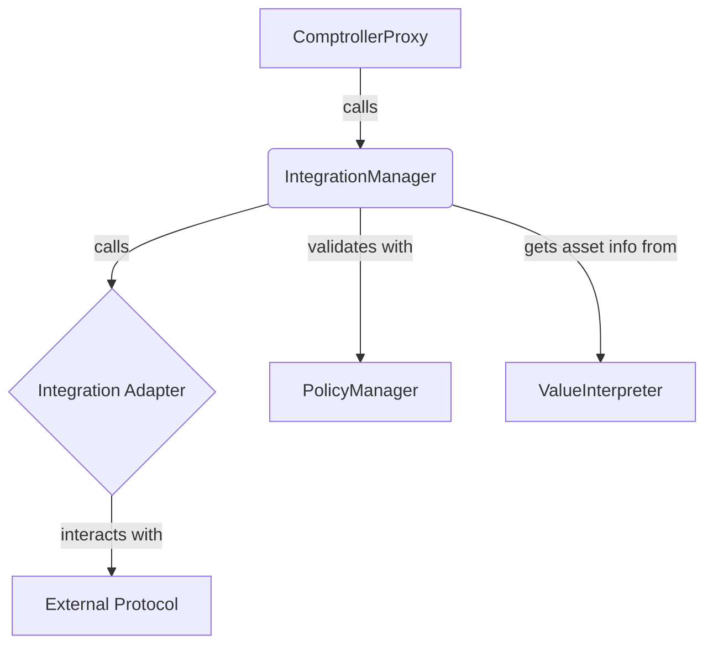

# IntegrationManager Contract Documentation

## Overview

The `IntegrationManager` is the gateway for funds to interact with the broader DeFi ecosystem. It provides a standardized interface for calling external protocols through a system of "integration adapters."

## Function-by-Function Analysis

### `receiveCallFromComptroller()`
**Visibility:** `external`
**Purpose:** The main entry point for all actions routed from the `ComptrollerProxy`. It decodes the action ID and dispatches the call to the appropriate internal function.
```solidity
function receiveCallFromComptroller(address _caller, uint256 _actionId, bytes calldata _callArgs)
    external override {
    // 1. Get the ComptrollerProxy (caller) and associated VaultProxy addresses.
    address comptrollerProxy = msg.sender;
    address vaultProxy = getVaultProxyForFund(comptrollerProxy);
    require(vaultProxy != address(0), "receiveCallFromComptroller: Fund is not valid");

    // 2. Ensure the original caller is authorized to manage the fund's assets.
    require(IVault(vaultProxy).canManageAssets(_caller), "receiveCallFromComptroller: Unauthorized");

    // 3. Dispatch to the correct internal function based on the action ID.
    if (_actionId == 0) { // Corresponds to `callOnIntegration`
        __callOnIntegration(_caller, comptrollerProxy, vaultProxy, _callArgs);
    } else if (_actionId == 1) { // Corresponds to `addTrackedAssetsToVault`
        __addTrackedAssetsToVault(_caller, comptrollerProxy, _callArgs);
    } else if (_actionId == 2) { // Corresponds to `removeTrackedAssetsFromVault`
        __removeTrackedAssetsFromVault(_caller, comptrollerProxy, _callArgs);
    } else {
        revert("receiveCallFromComptroller: Invalid _actionId");
    }
}
```

### `__callOnIntegration()`
**Visibility:** `private`
**Purpose:** The core logic for interacting with an external protocol via an adapter.
```solidity
function __callOnIntegration(
    address _caller,
    address _comptrollerProxy,
    address _vaultProxy,
    bytes memory _callArgs
) private {
    // 1. Ensure the fund is active by checking that the ComptrollerProxy is the current accessor of the VaultProxy.
    require(_comptrollerProxy == IVault(_vaultProxy).getAccessor(), "receiveCallFromComptroller: Fund is not active");

    // 2. Decode the arguments: adapter, selector, and integration-specific data.
    (address adapter, bytes4 selector, bytes memory integrationData) = __decodeCallOnIntegrationArgs(_callArgs);

    // 3. Execute the core integration logic (pre-processing, call, and post-processing).
    (
        address[] memory incomingAssets,
        uint256[] memory incomingAssetAmounts,
        address[] memory spendAssets,
        uint256[] memory spendAssetAmounts
    ) = __callOnIntegrationInner(_comptrollerProxy, _vaultProxy, adapter, selector, integrationData);

    // 4. Validate the action against the fund's policies (e.g., adapter whitelist).
    IPolicyManager(getPolicyManager()).validatePolicies(
        _comptrollerProxy,
        IPolicyManager.PolicyHook.PostCallOnIntegration,
        abi.encode(_caller, adapter, selector, incomingAssets, incomingAssetAmounts, spendAssets, spendAssetAmounts)
    );

    // 5. Emit an event with the details of the integration call.
    emit CallOnIntegrationExecutedForFund(
        _comptrollerProxy, _caller, adapter, selector, integrationData,
        incomingAssets, incomingAssetAmounts, spendAssets, spendAssetAmounts
    );
}
```

### `__callOnIntegrationInner()`
**Visibility:** `private`
**Purpose:** A helper function to avoid "stack too deep" errors by orchestrating the main steps of an integration call.
```solidity
function __callOnIntegrationInner(
    // ... params ...
) private returns (
    address[] memory incomingAssets_,
    uint256[] memory incomingAssetAmounts_,
    address[] memory spendAssets_,
    uint256[] memory spendAssetAmounts_
) {
    // 1. Pre-process the call: parse assets from the adapter, record pre-call balances, and approve/transfer spend assets.
    ( /* ... many local variables for pre-call data ... */ ) = __preProcessCoI(_comptrollerProxy, _vaultProxy, _adapter, _selector, _integrationData);

    // 2. Execute the low-level call on the integration adapter.
    __executeCoI(
        _vaultProxy, _adapter, _selector, _integrationData,
        abi.encode(spendAssets_, maxSpendAssetAmounts, incomingAssets_)
    );

    // 3. Post-process the call: reconcile asset balances, check for slippage, and clean up approvals.
    (incomingAssetAmounts_, spendAssetAmounts_) = __postProcessCoI(
        _comptrollerProxy, _vaultProxy, _adapter,
        incomingAssets_, preCallIncomingAssetBalances, minIncomingAssetAmounts,
        spendAssetsHandleType, spendAssets_, maxSpendAssetAmounts, preCallSpendAssetBalances
    );

    // 4. Return the results.
    return (incomingAssets_, incomingAssetAmounts_, spendAssets_, spendAssetAmounts_);
}
```
---
## Mermaid Diagram

