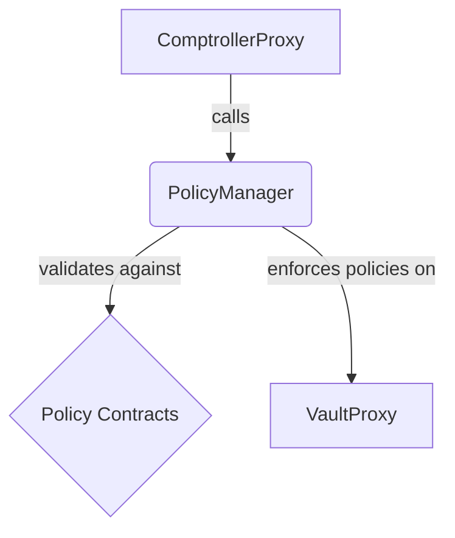

# PolicyManager Contract Documentation

## Overview

The `PolicyManager` is an extension that enforces rules and restrictions on a fund's activities. Policies can govern a wide range of behaviors, from asset whitelist/blacklists to investor qualifications.

## Function-by-Function Analysis

### `setConfigForFund()`
**Visibility:** `external`
**Purpose:** Configures the policies for a fund during its setup or reconfiguration.
**Access Control:** `onlyFundDeployer`
```solidity
function setConfigForFund(address _comptrollerProxy, address _vaultProxy, bytes calldata _configData)
    external override onlyFundDeployer {
    // 1. Cache the VaultProxy address to link it with the ComptrollerProxy.
    __setValidatedVaultProxy(_comptrollerProxy, _vaultProxy);
    // 2. If no config data is provided, there's nothing to do.
    if (_configData.length == 0) { return; }

    // 3. Decode the configuration data into an array of policy contracts and their settings.
    (address[] memory policies, bytes[] memory settingsData) = abi.decode(_configData, (address[], bytes[]));
    // 4. Sanity check: ensure the arrays are of equal length.
    require(policies.length == settingsData.length, "setConfigForFund: policies and settingsData array lengths unequal");

    // 5. Loop through each policy and enable it for the fund.
    for (uint256 i; i < policies.length; i++) {
        __enablePolicyForFund(_comptrollerProxy, policies[i], settingsData[i], IPolicy(policies[i]).implementedHooks());
    }
}
```

### `validatePolicies()`
**Visibility:** `external`
**Purpose:** The core validation function. It is called by other components (like the `ComptrollerLib` or `IntegrationManager`) before a protected action occurs to ensure the action is compliant with all relevant policies.
```solidity
function validatePolicies(address _comptrollerProxy, PolicyHook _hook, bytes calldata _validationData)
    external override {
    // 1. Get all policies enabled for the given hook. If there are none, no validation is needed.
    address[] memory policies = getEnabledPoliciesOnHookForFund(_comptrollerProxy, _hook);
    if (policies.length == 0) { return; }

    // 2. Ensure the caller is a trusted component of the protocol (the fund's Comptroller or one of its managers).
    require(
        msg.sender == _comptrollerProxy || msg.sender == IComptroller(_comptrollerProxy).getIntegrationManager()
            || msg.sender == IComptroller(_comptrollerProxy).getExternalPositionManager(),
        "validatePolicies: Caller not allowed"
    );

    // 3. Loop through each policy and execute its `validateRule` function. If any rule returns `false`, the transaction reverts with a descriptive error.
    for (uint256 i; i < policies.length; i++) {
        require(
            IPolicy(policies[i]).validateRule(_comptrollerProxy, _hook, _validationData),
            string(abi.encodePacked("Rule evaluated to false: ", IPolicy(policies[i]).identifier()))
        );
    }
}
```

### `enablePolicyForFund()`
**Visibility:** `external`
**Purpose:** Allows the fund owner to add a new policy to the fund after its initial setup.
**Access Control:** `onlyFundOwner`
```solidity
function enablePolicyForFund(address _comptrollerProxy, address _policy, bytes calldata _settingsData)
    external override onlyFundOwner(_comptrollerProxy) {
    // 1. Get the list of hooks this policy implements.
    PolicyHook[] memory implementedHooks = IPolicy(_policy).implementedHooks();

    // 2. Check if any of the hooks restrict actions of current investors (e.g., transfer or redemption). Such policies cannot be added after fund creation.
    for (uint256 i; i < implementedHooks.length; i++) {
        require(
            !__policyHookRestrictsCurrentInvestorActions(implementedHooks[i]),
            "enablePolicyForFund: _policy restricts actions of current investors"
        );
    }

    // 3. Call the internal helper to enable the policy.
    __enablePolicyForFund(_comptrollerProxy, _policy, _settingsData, implementedHooks);

    // 4. Call the `activateForFund` function on the policy itself.
    __activatePolicyForFund(_comptrollerProxy, _policy);
}
```

### `__enablePolicyForFund()`
**Visibility:** `private`
**Purpose:** The core logic for adding a policy to a fund's configuration.
```solidity
function __enablePolicyForFund(
    address _comptrollerProxy,
    address _policy,
    bytes memory _settingsData,
    PolicyHook[] memory _hooks
) private {
    // 1. If settings data is provided, call the policy contract to add the fund-specific settings.
    if (_settingsData.length > 0) {
        IPolicy(_policy).addFundSettings(_comptrollerProxy, _settingsData);
    }

    // 2. Loop through all the hooks that the policy implements.
    for (uint256 i; i < _hooks.length; i++) {
        // 3. Ensure the policy is not already enabled for this hook.
        require(!policyIsEnabledOnHookForFund(_comptrollerProxy, _hooks[i], _policy), "__enablePolicyForFund: Policy is already enabled");
        // 4. Add the policy to the list for the given hook.
        comptrollerProxyToHookToPolicies[_comptrollerProxy][_hooks[i]].push(_policy);
    }

    // 5. Emit an event to log the enablement.
    emit PolicyEnabledForFund(_comptrollerProxy, _policy, _settingsData);
}
```

### `__policyHookRestrictsCurrentInvestorActions()`
**Visibility:** `private pure`
**Purpose:** A helper to check if a policy hook is one that cannot be added to a fund after it's live.
```solidity
function __policyHookRestrictsCurrentInvestorActions(PolicyHook _hook)
    private pure returns (bool restrictsActions_) {
    // 1. Returns true if the hook is for transferring or redeeming shares, as these actions affect existing shareholders' rights.
    return _hook == PolicyHook.PreTransferShares || _hook == PolicyHook.RedeemSharesForSpecificAssets;
}
```
---
## Mermaid Diagram

