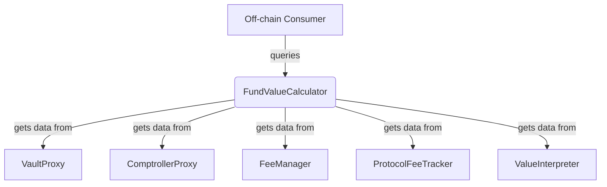

# FundValueCalculator Contract Documentation

## Overview

The `FundValueCalculator` is a peripheral contract that provides various calculations related to a fund's value. It is primarily intended for off-chain use, as some of its calculations can be gas-intensive and may even settle fees, altering the state of the fund.

## Function-by-Function Analysis

### `calcGav()`
**Visibility:** `public`
**Purpose:** Calculates the Gross Asset Value (GAV) of a fund.
```solidity
function calcGav(address _vaultProxy) public override returns (address denominationAsset_, uint256 gav_) {
    // 1. Get the ComptrollerProxy for the given VaultProxy.
    IComptroller comptrollerProxyContract = __getComptrollerProxyForVault(_vaultProxy);
    // 2. Return the denomination asset and the GAV, which is calculated by the `calcGav` function on the fund's `ComptrollerProxy`.
    return (comptrollerProxyContract.getDenominationAsset(), comptrollerProxyContract.calcGav());
}
```

### `calcNav()`
**Visibility:** `public`
**Purpose:** Calculates the Net Asset Value (NAV) of a fund. This is a state-changing operation as it triggers fee settlements.
```solidity
function calcNav(address _vaultProxy) public override returns (address denominationAsset_, uint256 nav_) {
    // 1. Get the total supply of shares *before* settling any fees.
    uint256 preSharesSupply = ERC20(_vaultProxy).totalSupply();

    // 2. Calculate the net share value. This is a critical step that triggers the settlement of continuous fees.
    uint256 netShareValue;
    (denominationAsset_, netShareValue) = calcNetShareValue(_vaultProxy);

    // 3. Calculate the NAV by multiplying the pre-fee shares supply by the net share value. This ensures the NAV is based on the shares outstanding *before* fees were paid by minting new shares.
    nav_ = preSharesSupply.mul(netShareValue).div(SHARES_UNIT);

    // 4. Return the denomination asset and the NAV.
    return (denominationAsset_, nav_);
}
```

### `calcNetShareValue()`
**Visibility:** `public`
**Purpose:** Calculates the net value of one share of a fund. This is a state-changing operation.
```solidity
function calcNetShareValue(address _vaultProxy)
    public override returns (address denominationAsset_, uint256 netShareValue_) {
    // 1. Get the ComptrollerProxy for the fund.
    IComptroller comptrollerProxyContract = __getComptrollerProxyForVault(_vaultProxy);

    // 2. Trigger the settlement of all "Continuous" fees by calling the FeeManager via the ComptrollerProxy.
    comptrollerProxyContract.callOnExtension(getFeeManager(), 0, "");

    // 3. Calculate any protocol fee shares that are currently due but have not yet been minted.
    uint256 protocolFeeSharesDue = calcProtocolFeeDueForFund(_vaultProxy);

    // 4. Get the fund's denomination asset.
    denominationAsset_ = comptrollerProxyContract.getDenominationAsset();

    // 5. Calculate the net share value. This is GAV divided by the total supply of shares PLUS the shares that are about to be minted for the protocol fee.
    netShareValue_ = __calcShareValue(
        denominationAsset_,
        comptrollerProxyContract.calcGav(),
        ERC20(_vaultProxy).totalSupply().add(protocolFeeSharesDue)
    );
}
```

### `calcProtocolFeeDueForFund()`
**Visibility:** `public view`
**Purpose:** Calculates the amount of protocol fee shares currently due for a fund.
```solidity
function calcProtocolFeeDueForFund(address _vaultProxy) public view returns (uint256 sharesDue_) {
    // 1. Get the timestamp of the last protocol fee payment.
    uint256 lastPaid = IProtocolFeeTracker(getProtocolFeeTracker()).getLastPaidForVault(_vaultProxy);
    if (lastPaid >= block.timestamp || lastPaid == 0) {
        return 0;
    }

    // 2. Calculate the number of seconds that have passed since the last payment.
    uint256 secondsDue = block.timestamp.sub(lastPaid);

    // 3. Calculate the raw number of shares due based on the fee rate and time passed.
    uint256 sharesSupply = ERC20(_vaultProxy).totalSupply();
    uint256 rawSharesDue = sharesSupply.mul(
        IProtocolFeeTracker(getProtocolFeeTracker()).getFeeBpsForVault(_vaultProxy)
    ).mul(secondsDue).div(SECONDS_IN_YEAR).div(MAX_BPS);

    // 4. Adjust for the fact that the new shares dilute the value of existing shares.
    uint256 supplyNetRawSharesDue = sharesSupply.sub(rawSharesDue);
    if (supplyNetRawSharesDue == 0) {
        return 0;
    }

    // 5. Apply the 50% buyback discount and return the final amount of shares due.
    return rawSharesDue.mul(sharesSupply).div(supplyNetRawSharesDue).div(BUYBACK_DISCOUNT_DIVISOR);
}
```

### `__calcShareValue()`
**Visibility:** `private view`
**Purpose:** A helper to calculate the value of a single share.
```solidity
function __calcShareValue(address _denominationAsset, uint256 _assetsValue, uint256 _sharesSupply)
    private view returns (uint256 shareValue_) {
    // 1. If there are no shares, the share price is defined as 1 unit of the denomination asset.
    if (_sharesSupply == 0) {
        return 10 ** uint256(ERC20(_denominationAsset).decimals());
    }

    // 2. Otherwise, calculate the share value as (total asset value * 1e18) / total shares.
    return _assetsValue.mul(SHARES_UNIT).div(_sharesSupply);
}
```
---
## Mermaid Diagram

