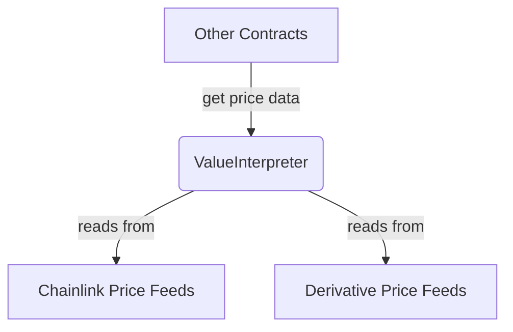

# ValueInterpreter Contract Documentation

## Overview

The `ValueInterpreter` is a critical infrastructure component that serves as the protocol's oracle aggregator. It provides a unified interface for calculating the value of one asset in terms of another, abstracting away the complexities of different price feed providers (primarily Chainlink for primitives and custom feeds for derivatives).

## Function-by-Function Analysis

### `calcCanonicalAssetValue()`
**Visibility:** `external`
**Purpose:** The main public function for asset value calculation. It can handle conversions between primitive assets, derivatives, and combinations thereof.
```solidity
function calcCanonicalAssetValue(address _baseAsset, uint256 _amount, address _quoteAsset)
    external override returns (uint256 value_) {
    // 1. If the assets are the same or the amount is zero, no conversion is needed.
    if (_baseAsset == _quoteAsset || _amount == 0) { return _amount; }

    // 2. If the quote asset is a primitive (like a stablecoin or WETH), use the standard asset valuation logic.
    if (isSupportedPrimitiveAsset(_quoteAsset)) {
        return __calcAssetValue(_baseAsset, _amount, _quoteAsset);
    }
    // 3. If converting from a primitive to a derivative (a less common case), use the specialized function.
    else if (isSupportedDerivativeAsset(_quoteAsset) && isSupportedPrimitiveAsset(_baseAsset)) {
        return __calcPrimitiveToDerivativeValue(_baseAsset, _amount, _quoteAsset);
    }

    // 4. If the conversion pair is not supported, revert.
    revert("calcCanonicalAssetValue: Unsupported conversion");
}
```

### `__calcAssetValue()`
**Visibility:** `private`
**Purpose:** An internal helper that routes to the correct valuation logic based on whether the `_baseAsset` is a primitive or a derivative.
```solidity
function __calcAssetValue(address _baseAsset, uint256 _amount, address _quoteAsset)
    private returns (uint256 value_) {
    // 1. If assets are the same or amount is zero, return early.
    if (_baseAsset == _quoteAsset || _amount == 0) {
        return _amount;
    }

    // 2. If the base asset is a primitive, use the Chainlink-based logic (`__calcCanonicalValue` is inherited).
    if (isSupportedPrimitiveAsset(_baseAsset)) {
        return __calcCanonicalValue(_baseAsset, _amount, _quoteAsset);
    }

    // 3. If the base asset is a derivative, find its registered price feed.
    address derivativePriceFeed = getPriceFeedForDerivative(_baseAsset);
    if (derivativePriceFeed != address(0)) {
        // 4. Use the derivative's price feed to get its underlying asset values, and recursively value them.
        return __calcDerivativeValue(derivativePriceFeed, _baseAsset, _amount, _quoteAsset);
    }

    // 5. If the asset is neither a supported primitive nor derivative, revert.
    revert("__calcAssetValue: Unsupported _baseAsset");
}
```

### `__calcDerivativeValue()`
**Visibility:** `private`
**Purpose:** An internal helper to calculate the value of a derivative asset by breaking it down into its underlying components and summing their values.
```solidity
function __calcDerivativeValue(
    address _derivativePriceFeed,
    address _derivative,
    uint256 _amount,
    address _quoteAsset
) private returns (uint256 value_) {
    // 1. Get the underlying assets and their corresponding amounts from the derivative's specific price feed contract.
    (address[] memory underlyings, uint256[] memory underlyingAmounts) =
        IDerivativePriceFeed(_derivativePriceFeed).calcUnderlyingValues(_derivative, _amount);

    // 2. Sanity checks.
    require(underlyings.length > 0, "__calcDerivativeValue: No underlyings");
    require(underlyings.length == underlyingAmounts.length, "__calcDerivativeValue: Arrays unequal lengths");

    // 3. Loop through each underlying asset.
    for (uint256 i = 0; i < underlyings.length; i++) {
        // 4. Recursively call `__calcAssetValue` to determine the value of the underlying asset in the desired quote asset.
        uint256 underlyingValue = __calcAssetValue(underlyings[i], underlyingAmounts[i], _quoteAsset);
        // 5. Sum the values of the underlying assets to get the total value of the derivative.
        value_ = value_.add(underlyingValue);
    }
}
```
---
## Mermaid Diagram

